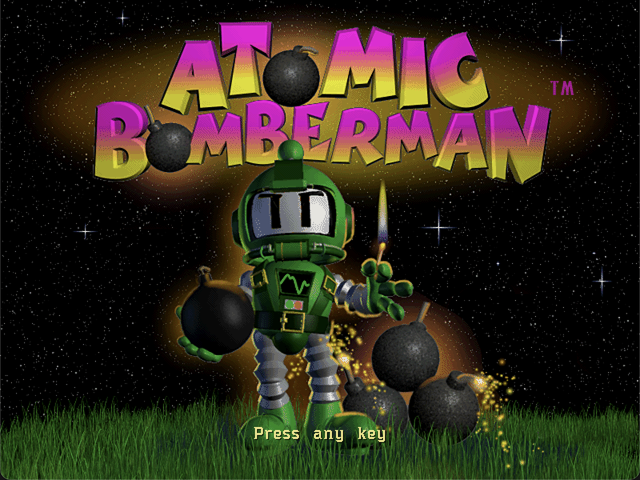
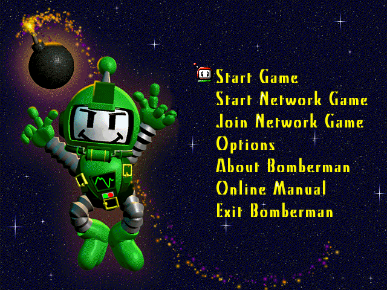
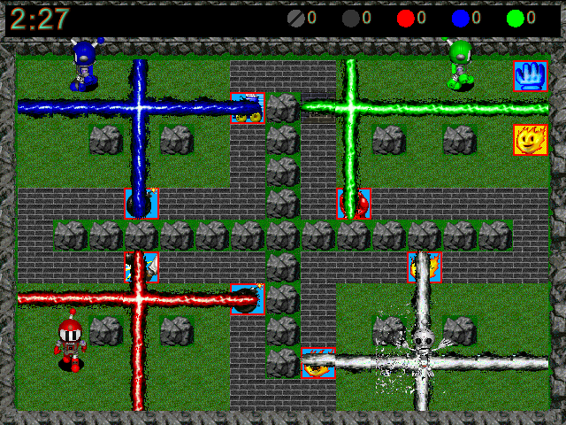
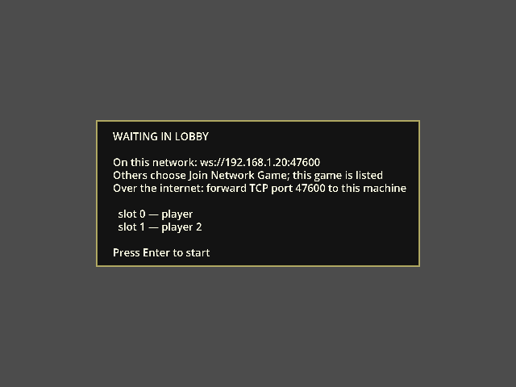
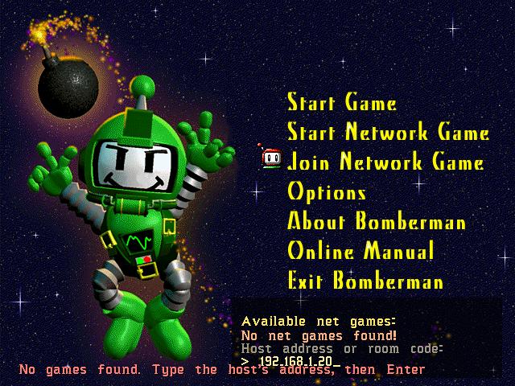

# Atomic Bomberman — a from-scratch Godot 4 port

A reimplementation of the 1997 DOS/Windows *Atomic Bomberman* in Godot 4,
built by reverse-engineering the original disc and binary rather than by
copying another project's guesswork. Every constant, sprite, sound, and
algorithm in this port traces back to a specific byte on the disc or a
specific address in `BM95.EXE`'s own disassembly — and where that isn't
possible, the gap is written down instead of guessed over.

For the human-language version of this document, see
**[HUMAN_README.md](HUMAN_README.md)**.

## Screenshots — the Godot port, live

Rendered by the port from the player's own game data — the art is the
original's, extracted from a disc at build time and never committed here.

| Title | Main menu |
|---|---|
|  |  |



The gameplay shot is real, not staged for the screenshot: five
players, four simultaneous bomb explosions, and the brick/powerup/wall art
all drawn from the original's own sprite sheets.

### Network play, from the menu

| Hosting: the lobby tells you what to read out | Joining: pick a listed game, or type the address |
|---|---|
|  |  |

No command line needed. **Start Network Game** opens a lobby that shows the
address others need; **Join Network Game** lists games heard on the LAN and
takes a typed address for anything else. When a match is won everyone
returns to the lobby, and the host starts the next one. Step-by-step, and
what every on-screen message means: [docs/MULTIPLAYER.md](docs/MULTIPLAYER.md).

## What actually works

- The game **starts, plays, and finishes** entirely on the original's own
  screens, art, sounds, and level data.
- **Full network play, started from the menu** — host and join without a
  terminal, play match after match from the lobby, rejoin a dropped game
  into your own seat. WebSocket server/client, server-authoritative,
  checked by an FNV-1a state hash every tick, and a test that fails if the
  view ever reads a field the network does not carry.
- **Every one of the 67 shipped multiplayer schemes** loads and plays, with
  team splits, player-start stacking, and per-scheme powerup overrides all
  read from the scheme file itself.
- **All 13 powerups**, all 12 diseases, kick/punch/grab/spooge/trigger/jelly
  bomb abilities, the closing wall ("Hurry"), brick regrowth, campaign mode,
  and bots with a real (if simplified) AI.
- **A from-scratch bot AI** built by disassembling `BM95.EXE`'s own decision
  routine — not a fresh design, a read of what the original does.
- **A live in-game test editor** (press T) for placing bricks, dropping any
  powerup, spawning bombs, and killing/curing/diseasing a player, all
  without needing the right scheme or level loaded.

## How this was built

Nothing here is invented where the disc has an answer. The pipeline:

1. **`tools/extract.py`** reads the entire disc — 2,454 files, 16 stages —
   and writes out every asset in a form Godot can load: sprite atlases from
   `.ANI` files, screens from `.PCX`, the ten per-player colour transforms
   from `.RMP`/`COLOR.PAL`, sound effects from `.RSS` with per-file
   mono/stereo detection, all 67 scheme files, every tuning constant from
   `VALUELST.RES`, and the entire string table from `MESSAGES.TXT`.
2. **`tools/bmexe.py`** disassembles `BM95.EXE` itself for the four
   algorithms no data file states: movement and tile re-centring, powerup
   scatter sampling, flame propagation order, and the AI's full decision
   tree (an 8-handler priority table dispatched indirectly, driving a
   bounded breadth-first search over an influence map).
3. **`tools/inventory.py`** is the honesty check: it classifies all 2,454
   files on the disc by rule, and a file matching no rule is a hard build
   error. Every exclusion states why. Six files were wrongly excluded in an
   early pass and turned out to hold real content (`INSTALL.DAT` alone had
   18 files nowhere else on the disc) — the rule table now demands a
   measurement, not a description, before excluding anything.
4. **The Godot simulation** (`godot-project/scripts/sim/`) is
   integer-only — centipixels, no floats anywhere in game logic — so a
   client and server computing the same inputs get bit-identical results,
   checked every tick by the state hash.
5. **`tools/verify.sh`** is the single gate: 39 test suites, ~6,500
   assertions, a parse pass over every `.gd` file whether referenced or
   not, a real WebSocket match between a server and two clients, and a
   mutation-testing pass (`tools/mutate.py`) that deliberately breaks the
   simulation 213 ways to confirm the test suite would actually catch each
   one (211 of 213 caught; the other two are provably equivalent mutants,
   not gaps).

### Two things that make this port harder to get wrong than most

- **The two-parser rule.** `.SCH` scheme files are parsed twice — once in
  Python at build time (`tools/schemes.py`), once in GDScript at runtime
  (`scripts/core/scheme.gd`) — deliberately, so the two independent
  implementations catch each other's mistakes rather than sharing one bug.
- **Documented wrongness.** `docs/BUGS.md` doesn't just list what's fixed —
  it lists every wrong guess this project itself made along the way (a
  mis-transcribed resource number, a mutation-testing false negative caused
  by a crashed test being counted as a pass, a `str.replace` bug that
  inflated a 30 KB file to 82 MB) and how each was caught, so a mistake
  doesn't get quietly re-made.

## This session's work (2026-10-02)

Network play went from "works, if you are a developer with a terminal" to
something a player can use from the menu, and a run of defects that only
showed up between two windows was fixed — each with a test that fails
without the fix.

- **The match never ended over the network.** The server logged "match
  over" and then nothing — both windows sat on the final frame. A won match
  now returns everyone to the lobby with the result shown, and the host
  starts the next one.
- **Losing the server quit everybody's game.** Now: back to the menu, with
  the reason on screen. A join to an address where nothing answers no
  longer hangs forever.
- **A menu-only join could never work** — every menu-started game is named
  "player", and the server refused the duplicate. Duplicates are numbered.
- **Networked deaths still had no animation, and punched bombs flew
  flat**, because two fields the renderer reads never crossed the wire.
  Found by a new test that changes every player and bomb field on a server
  and checks what arrives.
- **The test editor crashed on every key in a network game.** It now edits
  the host's real game; a guest is told why it cannot.
- **A dropped player who rejoins gets their own seat, colour and score
  back**, even from the AI that kept it warm.
- **The flame's top arm sat ~3 px right of the centre** — the arm was
  right; the centre piece's art carries its stem off-centre in its frame.
  The vertical arms now line up on it: 2.75 px apart at the joint before,
  0.15 px after, measured on screen.
- **Flags typed before `--` are honoured with a warning** instead of being
  silently ignored, and `verify.sh` refuses to run beside an open game
  window instead of failing in a way that looks like a regression.

Itemized in `CHANGELOG.md`; the per-item reasoning in `docs/IMPROVEMENTS.md`.

## What's not done

- **Art.** The port plays on the original's own extracted art. A
  replacement set (the only path to a build that could ever be
  redistributed) is designed for (`docs/ART.md`, `tools/artpack.py`) but
  not drawn.
- Not yet compared with the original: the between-rounds scoreboard and
  win screen, and the level selection screen.
- Network play has no room codes without a directory server you run
  yourself (`directory/`); typing the host's address always works.
- The thirteen powerups are live-verified in single-player for the gloves
  and kick only; the rest pass their tests but await a human.
- The AI's search is a simplification of the original's — a graded danger
  map with breadth-first search, rather than the original's cloning-walker
  frontier over a 100-node pool — a deliberate, documented approximation,
  not a bug.

Full detail in `docs/STATUS.md` (current state, next action) and
`docs/BUGS.md` (every open question, with what would settle it).

## Repository layout

```
godot-project/     the Godot 4 project — the deliverable
  scripts/core/     constants, enums, the scheme parser (no engine deps)
  scripts/sim/      the simulation — integer-only, no engine deps
  scripts/net/      protocol, server, client
  scripts/render/   everything that draws
  tests/            39 suites (33 headless, 6 rendered) + the harness
  test_data/        TESTALL.SCH — a scheme with every powerup guaranteed
  verify.sh         the one command that has to stay green
tools/              the extraction toolkit — 21 Python scripts, one per
                    format on the disc, plus BM95.EXE's disassembler
docs/               the reverse-engineering record: what the disc says,
                    every defect and open question, the build plan
server/             Docker/nginx config for hosting a dedicated server
```

`original-game/` (the disc itself) and `git-reference-projects/` (third-party
reference ports) are gitignored — see `.gitignore` for the complete,
commented list of what's excluded and why.

## Running it

```bash
cd godot-project
godot --path .                          # needs a copy of the disc — see below
godot --path . -- --players 2           # two on one keyboard; flags go after --
AB_DATA=/path/to/disc godot --path .    # point at a disc that isn't at
                                         # ../original-game
```

Without game data, the data-driven test suites skip and the app falls back
to a built-in grid — it still runs. Extract real game data first with
`tools/extract.py` (see `tools/README.md`).

```bash
cd godot-project
./verify.sh                  # 39 suites, ~6500 checks
EXPORT=1 ./verify.sh         # plus both export presets, .pck probed
../tools/mutate.py            # mutation testing
```

Close every game window before running it — they share the LAN discovery
port, and `verify.sh` stops with a message naming the window's process if
one is open.

See `godot-project/README.md` for the full flag list and the T test
editor's controls.
